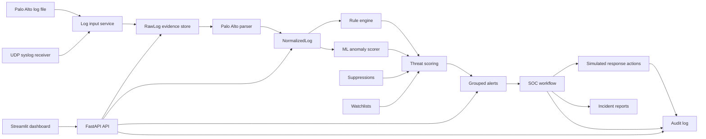

# MFU ATDR Architecture

ATDR is designed as a small SOC product for lab-pilot use. It keeps ingestion, parsing, detection, workflow, response simulation, audit, and ML governance separate so each part can be tested and explained.

## High-Level Flow

## Backend Components

- `parsers/`: robust Palo Alto syslog CSV parsing with raw evidence preservation.
- `services/log_service.py`: file and stream import into raw and normalized tables.
- `detection/rules.py`: explainable rule-based detection.
- `services/detection_service.py`: ML scoring, watchlist matching, suppression checks, grouping, and alert creation.
- `services/alert_service.py`: SOC workflow, notes, timeline, escalation, and reports.
- `services/response_service.py`: simulated block/unblock actions with audit attribution.
- `services/ml_service.py`: model training, scoring, run history, dataset profile, and drift signals.
- `routers/`: thin FastAPI API layer with role checks.

## Data Trust Model

Raw logs are retained first and treated as evidence. Normalized logs are derived records. Alerts reference normalized log IDs through `AlertEvidence`, so every dashboard finding can be traced back to source data.

## Security Boundaries

- JWT authentication protects operational APIs.
- Admin-only APIs manage response actions, users, demo controls, suppressions, watchlists, and ML operations.
- Response actions remain simulated by default.
- Live syslog ingestion binds to localhost unless deliberately configured otherwise.
